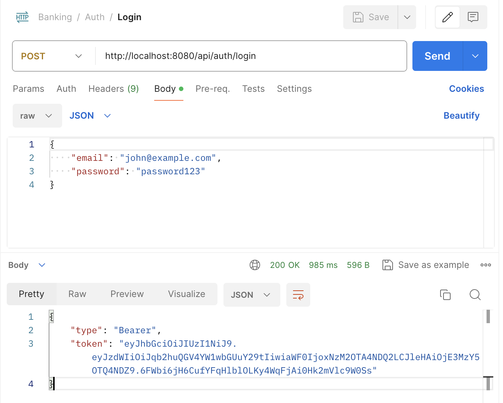
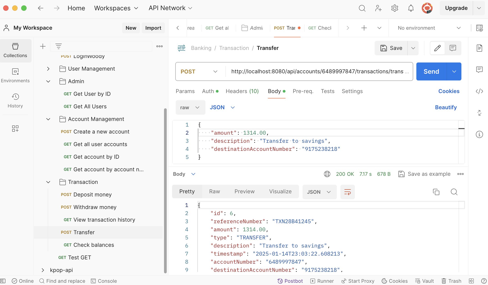
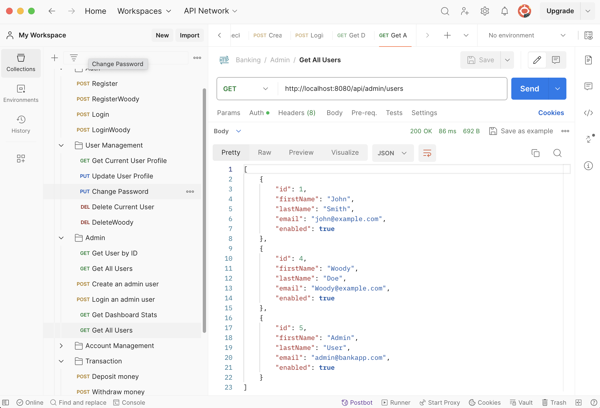
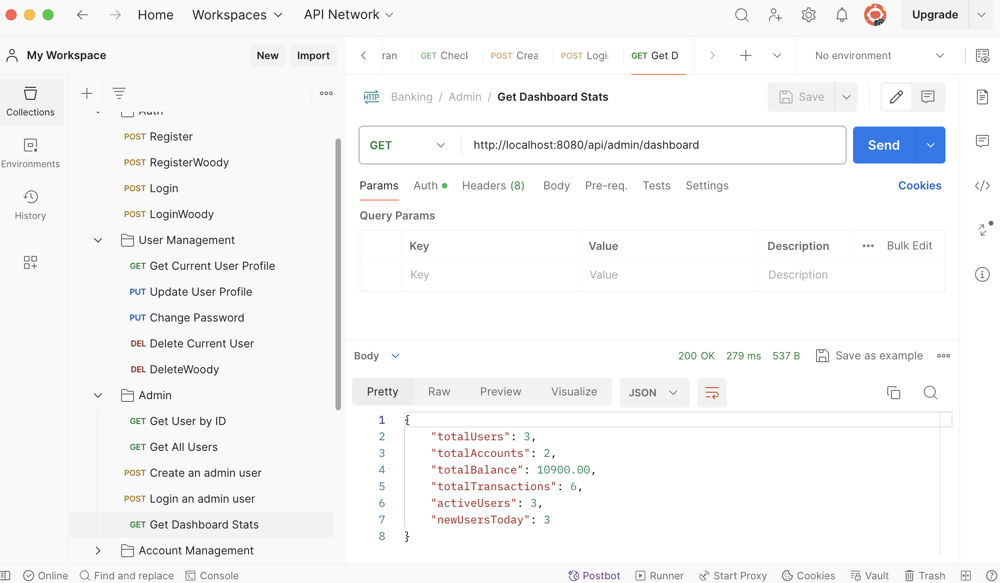
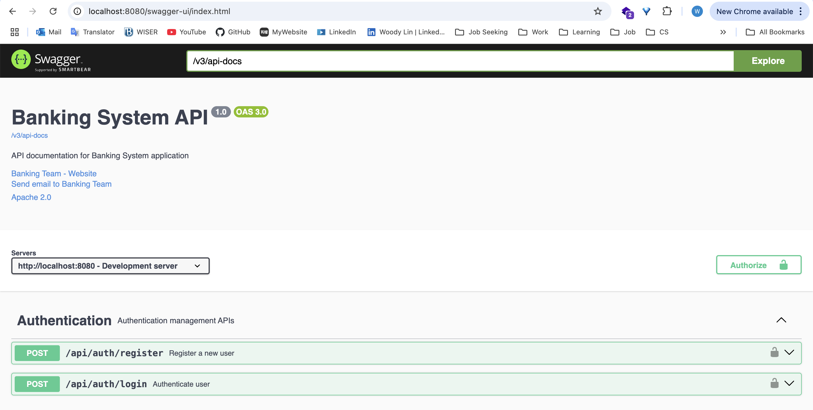
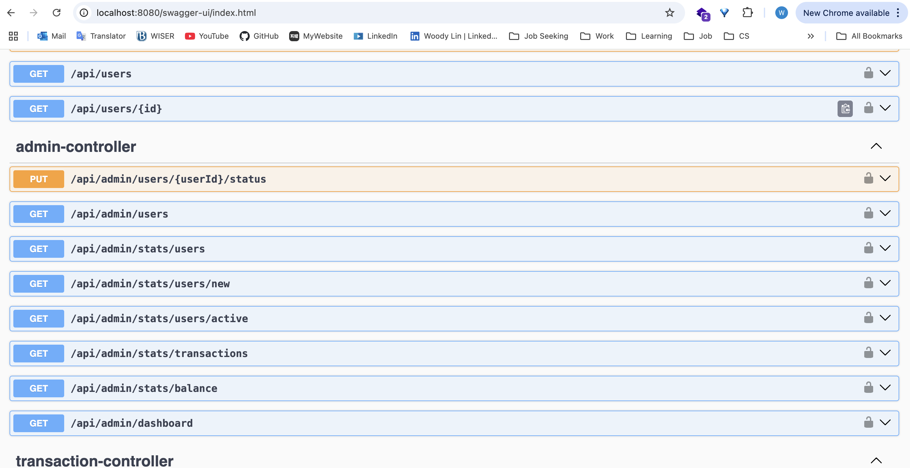
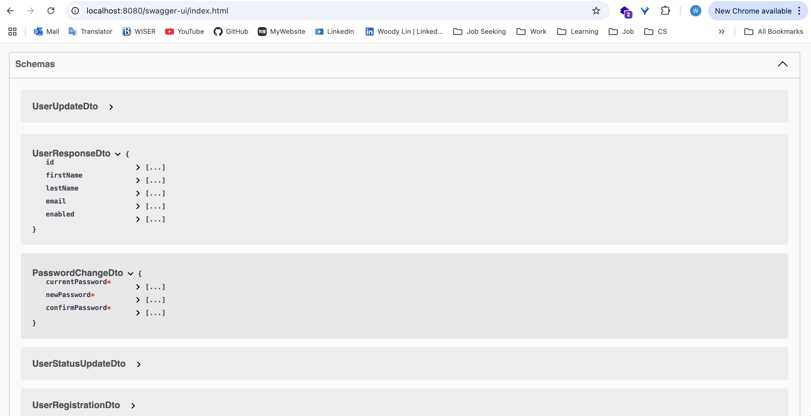
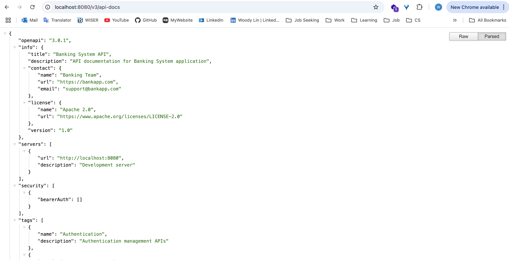

# Banking System Backend

A robust banking system built with Spring Boot that provides secure account management, transactions, and administrative features.

## Technologies Used

### Core Dependencies
- **Spring Boot** (3.2.2)
A framework for building Java-based applications with embedded servers, simplifying configuration and deployment.
  - **Spring Boot Starter Web**: Build web, including **RESTful**, applications using **Spring MVC** (Model-View-Controller). Uses Apache Tomcat as the default embedded container.
  - **Spring Boot Starter Parent**: Acts as the parent POM for Spring Boot projects and provides default dependency versions and plugin configurations.
  - **Spring Boot Starter Data JPA**: Persist data in **SQL** stores with Java Persistence API using Spring Data and **Hibernate**.
  - **Spring Boot Starter Security**: Highly customizable authentication and access-control framework for Spring applications.
  - **Spring Boot Starter Validation**: Bean Validation with Hibernate validator
  - **Spring Boot Starter Mail**: Send email using Java Mail and Spring Framework's JavaMailSender.
  - **Spring Boot Starter Thymeleaf**: A modern server-side Java template engine for both web and standalone environments. Allows HTML to be correctly displayed in browsers and as static prototypes.
- **Database**
  - **PostgreSQL**: A powerful, open-source relational database used to store and manage application data.
  - **Spring Data JPA**: Provides data access abstraction and *ORM* (Object-Relational Mapping) using JPA with repository-based data handling.
- **Security**
  - **Spring Security**: Handles application security with features like user authentication, authorization, and CSRF protection.
  - **JWT (JSON Web Token)** 0.12.3: Used for stateless user authentication by encoding claims in a compact, self-contained token.
- **Documentation**
  - SpringDoc OpenAPI (Swagger) 2.3.0: Automatically generates interactive API documentation compliant with the OpenAPI specification.
- **Testing**
  - JUnit 5: A popular framework for writing and running unit and integration tests.
  - **Mockito**: A mocking framework for unit tests to simulate dependencies.
  - **H2 Database** (for testing): An in-memory database used for lightweight and fast testing of database operations.
- **Other**
  - **Jakarta** Validation: Provides bean validation support for validating data models against constraints.
  - **Java 17**: The Long-Term Support (LTS) version of Java, providing enhanced performance and modern language features.
  - **Maven**: A build automation tool used for managing dependencies, compiling code, running tests, and building the project.


## Annotation
### Spring Core

- `@Configuration` - Indicates that a class declares one or more `@Bean` methods.
- `@Bean` - Indicates that a method produces a bean to be managed by Spring.
- `@Component` - Generic stereotype for any Spring-managed component.
- `@Service` - Indicates that a class is a service layer component.
- `@Repository` - Indicates that a class is a data repository.
- `@Autowired` - Marks a constructor, field, or setter method for dependency injection.
- `@Value` - Injects values from properties files.

---

### Spring Web (Spring MVC)

- `@RestController` - Combines `@Controller` and `@ResponseBody`.
- `@Controller` - Marks the class as a web controller.
- `@RequestMapping` - Maps web requests to specific handler classes/methods.
- `@GetMapping` - Shortcut for `@RequestMapping(method = RequestMethod.GET)`.
- `@PostMapping` - Shortcut for `@RequestMapping(method = RequestMethod.POST)`.
- `@PutMapping` - Shortcut for `@RequestMapping(method = RequestMethod.PUT)`.
- `@DeleteMapping` - Shortcut for `@RequestMapping(method = RequestMethod.DELETE)`.
- `@PathVariable` - Binds a path variable to a method parameter.
- `@RequestBody` - Binds the HTTP request body to a method parameter.
- `@RequestParam` - Binds request parameters to a method parameter.
- `@ResponseEntity` - Represents an HTTP response with body and status.

---

### Spring Security

- `@EnableWebSecurity` - Enables Spring Security's web security support.
- `@EnableMethodSecurity` - Enables method-level security.
- `@PreAuthorize` - Specifies the security constraints on a method.
- `@Secured` - Defines a list of security configuration attributes.
- `@SecurityConfig` - Configuration class for security settings.

---

### Spring Data JPA

- `@Entity` - Marks a class as a JPA entity.
- `@Table` - Specifies the table for an entity.
- `@Id` - Marks a field as the primary key.
- `@GeneratedValue` - Specifies generation strategy for primary keys.
- `@Column` - Specifies column mapping.
- `@ManyToOne` - Defines a many-to-one relationship.
- `@OneToMany` - Defines a one-to-many relationship.
- `@JoinColumn` - Specifies a column for joining an entity association.
- `@Transactional` - Defines transaction boundaries.
- `@Query` - Defines a custom query.

---

### Spring Boot

- `@SpringBootApplication` - Combines `@Configuration`, `@EnableAutoConfiguration`, and `@ComponentScan`.
- `@EnableAutoConfiguration` - Enables Spring Boot's auto-configuration.

---

### Spring Validation

- `@Valid` - Marks a property for validation.
- `@NotNull` - Validates that a value is not null.
- `@NotBlank` - Validates that a string is not blank.
- `@Size` - Validates size/length is within bounds.
- `@Email` - Validates email format.

---

### JPA/Persistence

- `@PrePersist` - Method to be called before an entity is persisted.
- `@PreUpdate` - Method to be called before an entity is updated.
- `@ElementCollection` - Specifies a collection of simple values.
- `@CollectionTable` - Specifies the table for element collections.
- `@Enumerated` - Specifies how to persist enums.

---

### OpenAPI/Swagger

- `@Tag` - Adds a tag to API documentation.
- `@Operation` - Describes an API operation.
- `@ApiResponse` - Documents possible responses.
- `@Parameter` - Documents an operation parameter.

---

### Test

- `@ExtendWith` - Used to register extensions for testing.
- `@SpringBootTest` - Bootstraps the full application context for tests.
- `@Test` - Marks a method as a test case.
- `@Mock` - Creates a mock object.
- `@InjectMocks` - Creates an object and injects mocked dependencies.
- `@BeforeEach` - Method to run before each test.


## Project Structure
```
src/
├── main/
│   ├── java/
│   │   └── com/
│   │       └── bankapp/
│   │           ├── config/          # Configuration classes
│   │           ├── controller/      # REST endpoints
│   │           ├── dto/            # Data Transfer Objects
│   │           ├── model/          # Entity classes
│   │           ├── repository/     # Data access layer
│   │           ├── security/       # Security configuration
│   │           ├── service/        # Business logic
│   │           └── util/           # Utility classes
│   └── resources/
│       ├── application.properties  # Application configuration
│       └── templates/             # Email templates
└── test/
    └── java/
        └── com/
            └── bankapp/
                └── service/        # Service tests
```

## Features

### User Management
- User registration and login
- JWT-based authentication
- Role-based authorization (USER, ADMIN)
- Profile management

### Account Management
- Create different types of accounts (Savings, Checking)
- View account details and balance
- Account status management

### Transaction Management
- Deposit funds
- Withdraw funds
- Transfer between accounts
- Transaction history
- Email notifications for transactions

### Admin Features
- User management
- Account oversight
- System statistics
- Transaction monitoring

## Setup and Installation

### Prerequisites
- Java 17 or higher
- Maven 3.6 or higher
- PostgreSQL 12 or higher

### Database Setup
```sql
CREATE DATABASE bankapp;
```

### Configuration
Update `src/main/resources/application.properties`:
```properties
# Database Configuration
spring.datasource.url=jdbc:postgresql://localhost:5432/bankapp
spring.datasource.username=your_username
spring.datasource.password=your_password

# JWT Configuration
jwt.secret=your_jwt_secret_key
jwt.expiration=86400000

# Email Configuration (if using email features)
spring.mail.host=smtp.gmail.com
spring.mail.port=587
spring.mail.username=your_email@gmail.com
spring.mail.password=your_app_specific_password
```

### Building and Running
```bash
# Build the project
mvn clean install

# Run the application
mvn spring-boot:run
```

## API Documentation

### Authentication Endpoints
```http
# Register a new user
POST /api/auth/register
Content-Type: application/json

{
    "firstName": "John",
    "lastName": "Doe",
    "email": "john@example.com",
    "password": "password123"
}

# Login
POST /api/auth/login
Content-Type: application/json

{
    "email": "john@example.com",
    "password": "password123"
}
```
You will get a **jwt_token** in the response after you login, which you need to include in the Authorization header for subsequent requests.

#### How JWT works:
1. A user logs in and provides valid credentials.
2. The server verifies the credentials, generates a JWT, and sends it to the user.
3. The client stores the token (e.g., in localStorage or cookies).
4. The client includes the token in the `Authorization` header of HTTP requests.
5. The server validates the token and allows or denies access based on its contents.



### Account Endpoints
```http
# Create account
POST /api/accounts
Authorization: Bearer {jwt_token}
Content-Type: application/json

{
    "type": "SAVINGS"
}

# Get user accounts
GET /api/accounts
Authorization: Bearer {jwt_token}
```

### Transaction Endpoints
```http
# Deposit
POST /api/accounts/{accountNumber}/transactions/deposit
Authorization: Bearer {jwt_token}
Content-Type: application/json

{
    "amount": 1000.00,
    "description": "Initial deposit"
}

# Transfer
POST /api/accounts/{accountNumber}/transactions/transfer
Authorization: Bearer {jwt_token}
Content-Type: application/json

{
    "amount": 100.00,
    "description": "Transfer to savings",
    "destinationAccountNumber": "destination_account_number"
}
```


### Admin Endpoints
```http
# Get dashboard statistics
GET /api/admin/dashboard
Authorization: Bearer {jwt_token}

# Get all users
GET /api/admin/users
Authorization: Bearer {jwt_token}
```



## Testing

### Running Tests
```bash
# Run all tests
mvn test

# Run specific test class
mvn test -Dtest=UserServiceTest

# Run with coverage report
mvn clean test
```

### API Testing with Postman
1. Import the Postman collection from `resource/Banking.postman_collection.json`
2. Set up environment variables:
   - `baseUrl`: http://localhost:8080
   - `jwt_token`: Token received from login

### Swagger UI and API Documentation





## Security Features
- Password encryption using BCrypt
- JWT-based authentication
- Role-based access control
- Secure email notifications
- Input validation
- Transaction validation

## Error Handling
- Global exception handling
- Custom exceptions for business logic
- Validation error responses
- Proper HTTP status codes

## Best Practices
- DTOs for data transfer
- Service layer for business logic
- Repository pattern for data access
- Unit testing with Mockito
- Swagger documentation
- Proper error handling
- Transaction management
- Secure password handling

## Contributing
1. Fork the repository
2. Create a feature branch
3. Commit your changes
4. Push to the branch
5. Create a Pull Request

## License
This project is licensed under the MIT License - see the LICENSE file for details.
